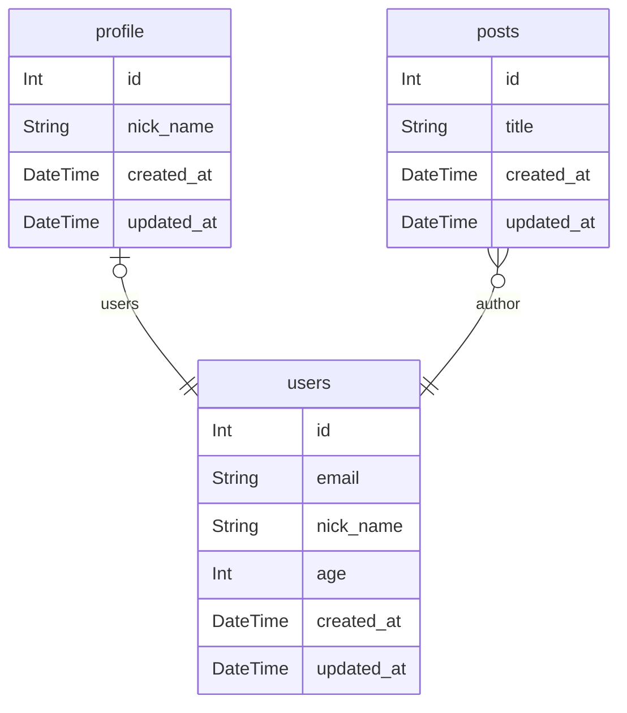

```mermaid
erDiagram
  users {
      Int id
    String email
    String nick_name
    Int age
    DateTime created_at
    DateTime updated_at
    }
  

  profile {
      Int id
    String nick_name
    DateTime created_at
    DateTime updated_at
    }
  

  posts {
      Int id
    String title
    DateTime created_at
    DateTime updated_at
    }
  
    profile o|--|| users : "users"
    posts o{--|| users : "author"
```
